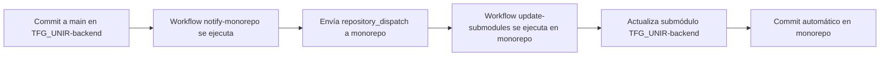

# Configuración de Sincronización Automática de Submódulos

## 📋 Objetivo

Configurar sincronización automática entre proyectos individuales y el monorepo, donde cada commit a `main` en un proyecto individual actualiza automáticamente el submódulo correspondiente en el monorepo.

## 🔧 Configuración Requerida

### 1. **Personal Access Token (PAT)**

Crear un PAT con permisos para disparar workflows:

1. Ve a GitHub → Settings → Developer settings → Personal access tokens → Tokens (classic)
2. Genera un nuevo token con estos scopes:
   - `repo` (Full control of private repositories)
   - `workflow` (Update GitHub Action workflows)
3. Copia el token generado

### 2. **Configurar Secrets en cada proyecto individual**

En cada repositorio individual (TFG_UNIR-backend, TFG_UNIR-frontend, etc.):

1. Ve a Settings → Secrets and variables → Actions
2. Añade un nuevo secret:
   - **Name**: `MONOREPO_DISPATCH_TOKEN`
   - **Value**: El PAT creado anteriormente

### 3. **Añadir workflows a los repositorios**

⚠️ **IMPORTANTE**: 
- `notify-monorepo.yml` va en cada proyecto individual (TFG_UNIR-backend, etc.)
- `update-submodules.yml` va SOLO en el monorepo (TFG_UNIR-monorepo)

#### En cada proyecto individual (ej: TFG_UNIR-backend):
- Archivo: `.github/workflows/notify-monorepo.yml`
- Contenido: Ver archivo `notify-monorepo-workflow.yml` generado

#### En el monorepo (TFG_UNIR-monorepo):
- Archivo: `.github/workflows/update-submodules.yml`  
- Contenido: Ver archivo `update-submodules-workflow.yml` generado

## 🚀 Flujo de Trabajo



## 📝 Ejemplo de Uso

1. **Developer hace push a TFG_UNIR-backend/main**:
   ```bash
   git push origin main
   ```

2. **Automáticamente se ejecuta**:
   - Workflow en TFG_UNIR-backend notifica al monorepo
   - Workflow en monorepo actualiza el submódulo
   - Se crea commit automático en monorepo

3. **Resultado**: Monorepo siempre sincronizado con la última versión

## 🔍 Monitoreo

### Ver ejecuciones:
- **Proyecto individual**: Actions tab → "Notify Monorepo on Main Update"
- **Monorepo**: Actions tab → "Update Submodules"

### Logs importantes:
```bash
# En el proyecto individual
echo "Notifying monorepo about commit: $GITHUB_SHA"

# En el monorepo  
echo "Updating submodule: TFG_UNIR-backend to commit: $SHA"
```

## 🛠️ Personalización

### Para añadir más proyectos:
1. Añadir el workflow `notify-monorepo.yml` al nuevo proyecto
2. Configurar el secret `MONOREPO_DISPATCH_TOKEN`
3. El workflow del monorepo ya maneja múltiples proyectos automáticamente

### Modificar comportamiento:
- **Cambiar ramas**: Modificar `branches: [ "main" ]` en el trigger
- **Añadir validaciones**: Añadir steps de testing antes de la notificación
- **Personalizar commits**: Modificar el mensaje de commit en el monorepo

## ⚠️ Consideraciones

1. **Permisos**: El PAT debe tener acceso a ambos repositorios
2. **Rate limits**: GitHub tiene límites en API calls
3. **Fallos**: Si falla la actualización, revisar logs en Actions
4. **Seguridad**: El PAT es sensible, mantenerlo seguro en Secrets

## 🧪 Testing

### Test manual:
```bash
# Disparar manualmente desde proyecto individual
gh workflow run notify-monorepo.yml

# Disparar manualmente desde monorepo
gh workflow run update-submodules.yml
```

### Verificar sincronización:
```bash
# En el monorepo
git submodule status
git log --oneline -5  # Ver commits automáticos
```