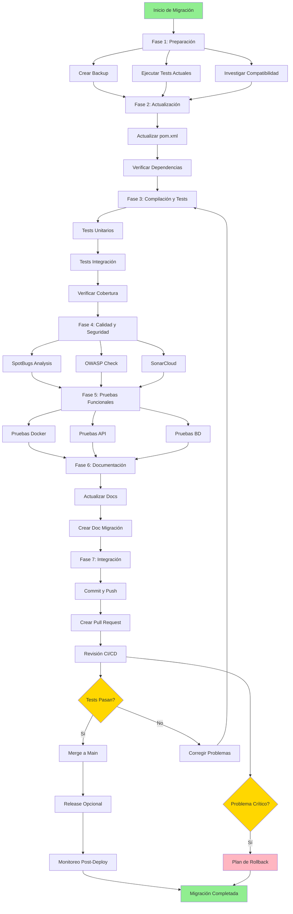

# Plan de Migración a Spring Boot 3.5

**Proyecto:** TFG_UNIR-backend
**Issue:** [#81](https://github.com/isidromerayo/TFG_UNIR-backend/issues/81)
**Versión Actual:** Spring Boot 3.4.12
**Versión Objetivo:** Spring Boot 3.5.9
**Fecha del Plan:** 2026-01-17
**Estado:** 📋 Planificación
**Rama:** `chore/upgrade-springboot-3-5`

---

## 📊 Resumen Ejecutivo

### Motivación

Según el documento [`SPRING_BOOT_LIFECYCLE.md`](../TFG_UNIR-backend/docs/SPRING_BOOT_LIFECYCLE.md), Spring Boot 3.4 finalizó su soporte OSS en noviembre de 2025. La migración a Spring Boot 3.5 es crítica para:

- ✅ Recibir actualizaciones de seguridad y parches
- ✅ Alinearse con Spring Framework 6.2
- ✅ Obtener soporte extendido hasta junio 2032 (comercial)
- ✅ Mantener compatibilidad con el ecosistema Spring

### Impacto Estimado

- **Riesgo:** 🟡 Medio
- **Complejidad:** 🟢 Baja-Media
- **Cambios Breaking:** Mínimos (migración entre versiones menores)
- **Tiempo de Implementación:** 1-2 sprints

---

## 🔍 Análisis del Estado Actual

### Configuración Actual

**Versión Spring Boot:** 3.4.12  
**Java:** 21  
**Build Tool:** Maven 3.x

### Dependencias Principales

| Dependencia | Versión Actual | Gestión | Notas |
|-------------|----------------|---------|-------|
| Spring Boot Parent | 3.4.12 | Parent POM | ⚠️ A actualizar |
| Spring Data JPA | (heredada) | Spring Boot | ✅ Compatible |
| Spring Security | (heredada) | Spring Boot | ✅ Compatible |
| Spring Web | (heredada) | Spring Boot | ✅ Compatible |
| Spring Actuator | (heredada) | Spring Boot | ✅ Compatible |
| MariaDB Driver | 3.5.6 | Explícita | ✅ Compatible |
| JJWT | 0.12.7 | Explícita | ✅ Compatible |
| SpringDoc OpenAPI | 2.5.0 | Explícita | ⚠️ Verificar compatibilidad |
| Commons Lang3 | 3.20.0 | Explícita | ✅ Compatible |
| Lombok | (heredada) | Spring Boot | ✅ Compatible |
| H2 Database | (heredada) | Spring Boot | ✅ Compatible |

### Plugins Maven

| Plugin | Versión | Estado |
|--------|---------|--------|
| maven-compiler-plugin | 3.14.0 | ✅ Actualizado |
| jacoco-maven-plugin | 0.8.14 | ✅ Actualizado |
| spotbugs-maven-plugin | 4.9.8.0 | ✅ Actualizado |
| maven-release-plugin | 3.3.1 | ✅ Actualizado |
| maven-failsafe-plugin | 3.5.4 | ✅ Actualizado |
| git-commit-id-plugin | 9.0.2 | ✅ Actualizado |

---

## 🎯 Objetivos de la Migración

### Objetivos Principales

1. ✅ Actualizar Spring Boot de 3.4.12 a **3.5.9**
2. ✅ Actualizar SpringDoc OpenAPI de 2.5.0 a **2.8.5+**
3. ✅ Mantener 100% de tests pasando (15 tests: 11 UT + 4 IT)
4. ✅ Preservar cobertura de código ≥85%
5. ✅ Verificar compatibilidad con todas las dependencias
6. ✅ Actualizar documentación del proyecto

### Objetivos Secundarios

1. 🔄 Actualizar dependencias compatibles a versiones más recientes
2. 📚 Documentar cambios y lecciones aprendidas
3. 🔒 Ejecutar análisis de seguridad (OWASP, Snyk)
4. 📊 Verificar métricas de calidad en SonarCloud

---

## ⚠️ Puntos de Atención Técnica

Basado en el análisis de la issue #81, estos son los puntos críticos a verificar durante la migración:

### 1. Spring Data REST y Serialización HAL

**Contexto:** El proyecto usa [`spring-boot-starter-data-rest`](../TFG_UNIR-backend/pom.xml#L80) que expone automáticamente los repositorios como endpoints REST con formato HAL (Hypertext Application Language).

**Riesgo:** 🔴 ALTO
- Las actualizaciones de Spring Boot incluyen nuevas versiones de Jackson
- Cambios en el formato HAL pueden romper el frontend Angular
- La estructura de `_links` y `_embedded` podría cambiar

**Acciones de Verificación:**
```bash
# 1. Arrancar la aplicación
./mvnw spring-boot:run

# 2. Verificar endpoint de cursos
curl -H "Accept: application/hal+json" http://localhost:8080/api/cursos | jq

# 3. Comparar estructura JSON antes y después
# Verificar que _links y _embedded mantienen la misma estructura
```

**Criterio de Éxito:**
- ✅ La estructura JSON es idéntica o compatible con la versión anterior
- ✅ Los enlaces HATEOAS funcionan correctamente
- ✅ El frontend Angular puede consumir los endpoints sin cambios

### 2. Hibernate 6.x: Validaciones más Estrictas

**Contexto:** Spring Boot 3.5 incluye Hibernate 6.6+ o 6.7, que es mucho más estricto con JPQL y SQL.

**Riesgo:** 🟡 MEDIO
- Consultas con "pequeños errores de sintaxis tolerados" ahora fallarán
- El proyecto usa `spring.jpa.hibernate.ddl-auto=update` (sensible a cambios)
- Validaciones de entidades más estrictas

**Acciones de Verificación:**
```bash
# 1. Revisar logs de arranque
./mvnw spring-boot:run | grep -i "hibernate\|validation\|query"

# 2. Buscar warnings específicos
# - "Query validation failed"
# - "Deprecated HQL syntax"
# - "Schema validation errors"

# 3. Ejecutar tests con logs detallados
./mvnw test -Dlogging.level.org.hibernate=DEBUG
```

**Archivos a Revisar:**
- Entidades JPA en `src/main/java/eu/estilolibre/tfgunir/backend/model/`
- Repositorios personalizados con `@Query`
- Configuración JPA en `application.properties`

**Criterio de Éxito:**
- ✅ Sin warnings de Hibernate en logs de arranque
- ✅ Todas las consultas JPQL validadas correctamente
- ✅ Schema de BD se actualiza sin errores

### 3. Actuator y Seguridad por Defecto

**Contexto:** El proyecto usa Spring Actuator con endpoints expuestos: `health`, `info`, `metrics`.

**Riesgo:** 🟡 MEDIO
- Spring Boot 3.5 puede ocultar más detalles por defecto
- El endpoint `/actuator/info` podría dejar de mostrar datos de Git
- Cambios en `management.info.git.mode`

**Acciones de Verificación:**
```bash
# 1. Verificar endpoint health
curl http://localhost:8080/actuator/health | jq

# 2. Verificar endpoint info (debe mostrar git commit)
curl http://localhost:8080/actuator/info | jq

# 3. Verificar métricas
curl http://localhost:8080/actuator/metrics | jq
```

**Configuración a Revisar:**
```properties
# application.properties
management.endpoints.web.exposure.include=health,info,metrics
management.info.git.mode=full  # Asegurar que muestra info completa
```

**Criterio de Éxito:**
- ✅ `/actuator/health` responde correctamente
- ✅ `/actuator/info` muestra información de Git y build
- ✅ `/actuator/metrics` está accesible

### 4. Gestión de Versiones de Dependencias

**Contexto:** El [`pom.xml`](../TFG_UNIR-backend/pom.xml) define versiones manuales para algunas dependencias que Spring Boot ya gestiona.

**Riesgo:** 🟡 MEDIO
- Versiones manuales pueden ser incompatibles con Spring Boot 3.5.9
- El parent de Spring Boot podría sugerir versiones mejor validadas

**Dependencias a Revisar:**

| Dependencia | Versión Manual | Acción Recomendada |
|-------------|----------------|-------------------|
| `mariadb-java-client` | 3.5.6 | ⚠️ Considerar eliminar versión manual |
| `springdoc-openapi` | 2.5.0 | 🔄 Actualizar a 2.8.5+ |
| `jjwt` | 0.12.7 | ✅ Mantener (no gestionada por Spring) |
| `commons-lang3` | 3.20.0 | ✅ Mantener (no gestionada por Spring) |

**Acción Específica para MariaDB:**
```xml
<!-- ANTES: Versión manual -->
<dependency>
    <groupId>org.mariadb.jdbc</groupId>
    <artifactId>mariadb-java-client</artifactId>
    <version>3.5.6</version>
    <scope>runtime</scope>
</dependency>

<!-- DESPUÉS: Dejar que Spring Boot gestione (RECOMENDADO) -->
<dependency>
    <groupId>org.mariadb.jdbc</groupId>
    <artifactId>mariadb-java-client</artifactId>
    <scope>runtime</scope>
</dependency>
```

**Verificación:**
```bash
# Ver qué versión sugiere Spring Boot 3.5.9
./mvnw dependency:tree | grep mariadb

# Comparar con versión manual actual
```

**Criterio de Éxito:**
- ✅ Dependencias compatibles con Spring Boot 3.5.9
- ✅ Sin conflictos de versiones en `dependency:tree`
- ✅ Conexión a MariaDB funciona correctamente

---

## 🔄 Flujo de Trabajo Visual



## 📋 Plan de Acción Detallado

### Fase 1: Preparación (Pre-migración)

#### 1.1 Crear Rama de Migración

```bash
git checkout main
git pull origin main
git checkout -b chore/upgrade-springboot-3-5
```

#### 1.2 Backup y Documentación

- [ ] Documentar versión actual de todas las dependencias
- [ ] Ejecutar suite completa de tests y guardar resultados
- [ ] Generar reporte de cobertura actual
- [ ] Ejecutar análisis de seguridad OWASP
- [ ] Crear snapshot del estado actual

**Comandos:**
```bash
# Tests completos
./mvnw clean verify -Pintegration-tests

# Cobertura
open target/site/jacoco/index.html

# Análisis de seguridad
./mvnw -Pdependency-check verify -Dnvd.api.key=${NVD_API_KEY}

# SpotBugs
./mvnw compile spotbugs:check
```

#### 1.3 Investigación de Compatibilidad

- [ ] Revisar [Spring Boot 3.5 Release Notes](https://github.com/spring-projects/spring-boot/wiki/Spring-Boot-3.5-Release-Notes)
- [ ] Verificar breaking changes en Spring Framework 6.2
- [ ] Comprobar compatibilidad de SpringDoc OpenAPI 2.5.0 con Spring Boot 3.5
- [ ] Revisar changelog de dependencias críticas

---

### Fase 2: Actualización de Dependencias

#### 2.1 Actualizar Spring Boot Parent

**Archivo:** [`pom.xml`](../TFG_UNIR-backend/pom.xml)

```xml
<parent>
    <groupId>org.springframework.boot</groupId>
    <artifactId>spring-boot-starter-parent</artifactId>
    <version>3.5.9</version>
    <relativePath />
</parent>
```

#### 2.2 Actualizar SpringDoc OpenAPI

**Archivo:** [`pom.xml`](../TFG_UNIR-backend/pom.xml)

Actualizar las propiedades de versión:

```xml
<properties>
    <!-- ... otras propiedades ... -->
    <springdoc-openapi-starter-webmvc-ui.version>2.8.5</springdoc-openapi-starter-webmvc-ui.version>
    <springdoc-openapi-starter-common.version>2.8.5</springdoc-openapi-starter-common.version>
</properties>
```

**Verificación:**
```bash
# Verificar compatibilidad de SpringDoc con Spring Boot 3.5.9
./mvnw dependency:tree | grep springdoc
```

#### 2.3 Revisar MariaDB Driver (Opcional)

**Opción A: Dejar que Spring Boot gestione la versión (RECOMENDADO)**

Eliminar la versión explícita en [`pom.xml`](../TFG_UNIR-backend/pom.xml):

```xml
<dependency>
    <groupId>org.mariadb.jdbc</groupId>
    <artifactId>mariadb-java-client</artifactId>
    <!-- Eliminar: <version>3.5.6</version> -->
    <scope>runtime</scope>
</dependency>
```

**Opción B: Mantener versión manual**

Si hay razones específicas para usar 3.5.6, mantener la versión actual.

**Verificación:**
```bash
# Ver qué versión sugiere Spring Boot 3.5.9
./mvnw dependency:tree | grep mariadb
```

#### 2.4 Verificar Otras Dependencias

Mantener versiones actuales (no requieren cambios):

1. **JJWT** (0.12.7) - ✅ Compatible
2. **Commons Lang3** (3.20.0) - ✅ Compatible

#### 2.3 Actualizar Plugins (si es necesario)

Verificar si hay actualizaciones disponibles para:
- maven-compiler-plugin
- jacoco-maven-plugin
- spotbugs-maven-plugin
- maven-failsafe-plugin

---

### Fase 3: Compilación y Tests

#### 3.1 Compilación Inicial

```bash
# Limpiar y compilar
./mvnw clean compile

# Verificar errores de compilación
# Resolver deprecations si existen
```

#### 3.2 Ejecución de Tests Unitarios

```bash
# Ejecutar tests unitarios
./mvnw test

# Analizar fallos si existen
# Ajustar tests si es necesario
```

#### 3.3 Ejecución de Tests de Integración

```bash
# Ejecutar tests de integración
./mvnw -DskipUTs -Pintegration-tests verify

# Verificar que todos pasan
```

#### 3.4 Suite Completa de Tests

```bash
# Ejecutar todos los tests con cobertura
./mvnw clean verify -Pintegration-tests

# Verificar cobertura ≥85%
open target/site/jacoco/index.html
```

---

### Fase 4: Análisis de Calidad y Seguridad

#### 4.1 Análisis Estático con SpotBugs

```bash
./mvnw compile spotbugs:check
```

**Criterio de Éxito:** Sin errores críticos

#### 4.2 Análisis de Seguridad OWASP

```bash
./mvnw -Pdependency-check verify -Dnvd.api.key=${NVD_API_KEY}
```

**Criterio de Éxito:** Sin vulnerabilidades críticas nuevas

#### 4.3 Análisis con SonarCloud

```bash
# Ejecutar análisis local (si está configurado)
./mvnw sonar:sonar

# O esperar a que se ejecute en CI/CD tras el push
```

**Criterio de Éxito:** 
- Quality Gate: PASSED
- Cobertura: ≥85%
- Sin bugs críticos nuevos

---

### Fase 5: Pruebas Funcionales

#### 5.1 Pruebas con Docker Compose

```bash
# Construir imagen actualizada
docker compose build

# Levantar servicios
docker compose up -d

# Verificar logs
docker compose logs -f backend

# Verificar endpoints
curl http://localhost:8080/actuator/health
curl http://localhost:8080/api/v1/cursos
```

#### 5.2 Pruebas de API

- [ ] Verificar autenticación JWT
- [ ] Probar endpoints CRUD principales
- [ ] Verificar Swagger UI: http://localhost:8080/swagger-ui.html
- [ ] Probar endpoints de Actuator

#### 5.3 Pruebas de Base de Datos

- [ ] Verificar conexión a MariaDB
- [ ] Comprobar migraciones/esquema
- [ ] Validar operaciones CRUD

---

### Fase 6: Documentación

#### 6.1 Actualizar Documentación Técnica

Archivos a actualizar:

1. **[`README.md`](../TFG_UNIR-backend/README.md)**
   - Badge de Spring Boot (línea 24)
   - Sección de Stack Tecnológico (línea 67)

2. **[`AGENTS.md`](../TFG_UNIR-backend/AGENTS.md)**
   - Versión de Spring Boot (línea 11)

3. **[`docs/SPRING_BOOT_LIFECYCLE.md`](../TFG_UNIR-backend/docs/SPRING_BOOT_LIFECYCLE.md)**
   - Actualizar sección "Versión Actual"
   - Marcar migración como completada

4. **[`DOCS_INDEX.md`](../TFG_UNIR-backend/DOCS_INDEX.md)**
   - Actualizar referencias si es necesario

#### 6.2 Crear Documento de Migración

Crear nuevo archivo: `docs/SPRING_BOOT_3.5_MIGRATION.md`

Contenido:
- Resumen de cambios realizados
- Problemas encontrados y soluciones
- Lecciones aprendidas
- Recomendaciones para futuras migraciones

#### 6.3 Actualizar CHANGELOG

Si existe `CHANGELOG.md`, añadir entrada:

```markdown
## [0.4.0] - 2026-01-XX

### Changed
- Actualizado Spring Boot de 3.4.12 a 3.5.x
- Actualizado Spring Framework a 6.2.x
- [Otras dependencias actualizadas]

### Fixed
- [Cualquier fix relacionado con la migración]
```

---

### Fase 7: Integración y Despliegue

#### 7.1 Commit y Push

```bash
# Añadir cambios
git add pom.xml
git add README.md AGENTS.md docs/

# Commit con mensaje descriptivo
git commit -m "chore: upgrade Spring Boot from 3.4.12 to 3.5.x

- Update spring-boot-starter-parent to 3.5.x
- Update documentation (README, AGENTS.md)
- All tests passing (15/15)
- Code coverage maintained at 85%
- Security analysis passed

Closes #81"

# Push a rama remota
git push -u origin feature/upgrade-spring-boot-3.5
```

#### 7.2 Crear Pull Request

**Título:** `chore: Upgrade Spring Boot to 3.5.x`

**Descripción:**
```markdown
## 🎯 Objetivo

Migrar el proyecto de Spring Boot 3.4.12 a Spring Boot 3.5.x para mantener soporte activo y recibir actualizaciones de seguridad.

## 📋 Cambios Realizados

- ✅ Actualizado `spring-boot-starter-parent` a 3.5.x
- ✅ Verificada compatibilidad de todas las dependencias
- ✅ Todos los tests pasando (15/15)
- ✅ Cobertura de código mantenida en 85%
- ✅ Análisis de seguridad OWASP ejecutado
- ✅ SpotBugs sin errores críticos
- ✅ Documentación actualizada

## 🧪 Testing

### Tests Unitarios
- ✅ 11/11 tests pasando

### Tests de Integración
- ✅ 4/4 tests pasando

### Cobertura
- ✅ 85% (objetivo: ≥80%)

### Análisis de Calidad
- ✅ SpotBugs: Sin errores críticos
- ✅ OWASP: Sin vulnerabilidades críticas nuevas
- ✅ SonarCloud: Quality Gate PASSED

## 🔍 Verificación Manual

- ✅ Aplicación arranca correctamente
- ✅ Endpoints API funcionando
- ✅ Autenticación JWT operativa
- ✅ Swagger UI accesible
- ✅ Conexión a MariaDB correcta

## 📚 Documentación

- ✅ README.md actualizado
- ✅ AGENTS.md actualizado
- ✅ SPRING_BOOT_LIFECYCLE.md actualizado
- ✅ Documento de migración creado

## 🔗 Referencias

- Issue: #81
- [Spring Boot 3.5 Release Notes](https://github.com/spring-projects/spring-boot/wiki/Spring-Boot-3.5-Release-Notes)
- [Spring Framework 6.2 What's New](https://docs.spring.io/spring-framework/reference/6.2/whatsnew.html)

Closes #81
```

#### 7.3 Revisión de CI/CD

Verificar que los workflows de GitHub Actions pasan:
- ✅ Build
- ✅ Tests
- ✅ SonarCloud Analysis
- ✅ Security Checks

#### 7.4 Merge y Release

Una vez aprobado el PR:

```bash
# Merge a main
git checkout main
git pull origin main

# Crear release (opcional)
./mvnw release:prepare -DskipTests -Darguments="-DskipTests"
./mvnw release:perform -DskipTests -Darguments="-DskipTests"
```

---

## 🚨 Gestión de Riesgos

### Riesgos Identificados

| Riesgo | Probabilidad | Impacto | Mitigación |
|--------|--------------|---------|------------|
| Tests fallan tras actualización | Media | Alto | Ejecutar tests antes y después; tener plan de rollback |
| Incompatibilidad de dependencias | Baja | Medio | Verificar compatibilidad antes de actualizar |
| Cambios breaking en Spring Security | Baja | Alto | Revisar release notes; probar autenticación exhaustivamente |
| Problemas con SpringDoc OpenAPI | Media | Medio | Verificar compatibilidad; actualizar si es necesario |
| Regresiones en producción | Baja | Alto | Testing exhaustivo; despliegue gradual |

### Plan de Rollback

Si se detectan problemas críticos:

1. **Rollback Inmediato:**
   ```bash
   git revert <commit-hash>
   git push origin main
   ```

2. **Rollback de Release:**
   ```bash
   # Volver a versión anterior en pom.xml
   git checkout <previous-commit> -- pom.xml
   git commit -m "revert: rollback Spring Boot to 3.4.12"
   git push origin main
   ```

3. **Rollback de Docker:**
   ```bash
   # Usar imagen anterior
   docker pull isidromerayo/spring-backend-tfg:0.3.1
   ```

---

## ✅ Criterios de Aceptación

### Criterios Obligatorios

- [ ] Spring Boot actualizado a 3.5.x en [`pom.xml`](../TFG_UNIR-backend/pom.xml)
- [ ] Compilación exitosa sin errores
- [ ] 15/15 tests pasando (11 UT + 4 IT)
- [ ] Cobertura de código ≥85%
- [ ] SpotBugs sin errores críticos
- [ ] OWASP sin vulnerabilidades críticas nuevas
- [ ] SonarCloud Quality Gate: PASSED
- [ ] Aplicación arranca correctamente
- [ ] Endpoints API funcionando
- [ ] Autenticación JWT operativa
- [ ] Documentación actualizada

### Criterios Opcionales

- [ ] Dependencias actualizadas a últimas versiones compatibles
- [ ] Documento de migración creado
- [ ] Performance similar o mejor que versión anterior
- [ ] Logs sin warnings relacionados con deprecations

---

## 📊 Métricas de Éxito

### Métricas Técnicas

| Métrica | Valor Actual | Valor Objetivo | Estado |
|---------|--------------|----------------|--------|
| Tests Pasando | 15/15 | 15/15 | ⏳ Pendiente |
| Cobertura | 85% | ≥85% | ⏳ Pendiente |
| Bugs Críticos | 0 | 0 | ⏳ Pendiente |
| Vulnerabilidades | 0 | 0 | ⏳ Pendiente |
| Quality Gate | PASSED | PASSED | ⏳ Pendiente |

### Métricas de Proceso

- **Tiempo de Migración:** TBD
- **Commits Necesarios:** TBD
- **Issues Encontrados:** TBD
- **Tiempo de Rollback (si necesario):** < 1 hora

---

## 📚 Referencias y Recursos

### Documentación Oficial

- [Spring Boot 3.5 Release Notes](https://github.com/spring-projects/spring-boot/wiki/Spring-Boot-3.5-Release-Notes)
- [Spring Boot 3.5 Migration Guide](https://github.com/spring-projects/spring-boot/wiki/Spring-Boot-3.5-Migration-Guide)
- [Spring Framework 6.2 What's New](https://docs.spring.io/spring-framework/reference/6.2/whatsnew.html)
- [Spring Boot Version Support](https://spring.io/projects/spring-boot#support)

### Documentación del Proyecto

- [`AGENTS.md`](../TFG_UNIR-backend/AGENTS.md) - Guía para agentes AI
- [`README.md`](../TFG_UNIR-backend/README.md) - Documentación principal
- [`SPRING_BOOT_LIFECYCLE.md`](../TFG_UNIR-backend/docs/SPRING_BOOT_LIFECYCLE.md) - Ciclo de vida de versiones
- [`DOCS_INDEX.md`](../TFG_UNIR-backend/DOCS_INDEX.md) - Índice de documentación

### Herramientas

- [Maven Versions Plugin](https://www.mojohaus.org/versions-maven-plugin/) - Para verificar actualizaciones
- [Spring Boot Migrator](https://github.com/spring-projects-experimental/spring-boot-migrator) - Herramienta de migración automática

---

## 🔄 Seguimiento y Actualizaciones

### Historial de Cambios del Plan

| Fecha | Versión | Cambios | Autor |
|-------|---------|---------|-------|
| 2026-01-17 | 1.0 | Plan inicial creado | AI Agent |

### Próximos Pasos

1. ⏳ Revisar y aprobar este plan
2. ⏳ Ejecutar Fase 1: Preparación
3. ⏳ Ejecutar Fase 2: Actualización
4. ⏳ Continuar con fases restantes

---

## 💡 Notas Adicionales

### Consideraciones Especiales

1. **Timing de la Migración:**
   - Realizar en periodo de baja actividad
   - Evitar viernes o vísperas de festivos
   - Tener equipo disponible para soporte

2. **Comunicación:**
   - Notificar al equipo antes de iniciar
   - Mantener actualizado el issue #81
   - Documentar problemas encontrados

3. **Monitoreo Post-Migración:**
   - Vigilar logs durante 48h después del despliegue
   - Monitorear métricas de performance
   - Estar preparado para rollback rápido

### Lecciones de Migraciones Anteriores

Basado en [`docs/security/LESSONS_LEARNED.md`](../TFG_UNIR-backend/docs/security/LESSONS_LEARNED.md):

- ✅ Siempre ejecutar suite completa de tests
- ✅ Verificar volúmenes Docker si hay cambios en BD
- ✅ Documentar exhaustivamente los cambios
- ✅ Tener plan de rollback preparado
- ✅ Comunicar cambios al equipo

---

## 📞 Contacto y Soporte

**Issue de Seguimiento:** [#81](https://github.com/isidromerayo/TFG_UNIR-backend/issues/81)  
**Repositorio:** https://github.com/isidromerayo/TFG_UNIR-backend

---

**Estado del Plan:** 📋 Pendiente de Aprobación  
**Última Actualización:** 2026-01-17
